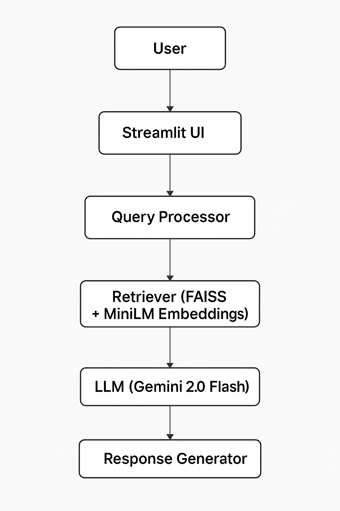

# ⚖️ AI Legal Assistant (Gemini 2.0 Flash + LangChain + FAISS)


This project implements a **Retrieval-Augmented Generation (RAG)** pipeline that can **answer legal or policy-based questions** using uploaded documents such as contracts, refund policies, or terms of service.

Powered by **Gemini 2.0 Flash**, this assistant combines **semantic search (FAISS)** and **context-aware reasoning (LangChain)** to provide grounded, verifiable answers.

---

##  Features
-  Upload any legal PDF (contracts, policies, agreements)  
-  Automatic text chunking + embedding + indexing  
-  Ask natural-language legal questions  
-  Cited, context-based answers generated by **Gemini 2.0 Flash**  
-  Works fully locally with FAISS + LangChain  

---

##  Tech Stack & Model Info

| Layer | Tool / Framework | Purpose |
|-------|------------------|----------|
| **LLM Model** | **Gemini 2.0 Flash (`gemini-2.0-flash-001`)** | Latest Google model optimized for fast, accurate RAG reasoning |
| **Frameworks** | LangChain, LangChain-Google-GenAI | Chain management and context retrieval |
| **Vector Database** | FAISS | High-speed semantic search over embedded documents |
| **Embeddings Model** | `sentence-transformers/all-MiniLM-L6-v2` | Creates dense vectors for document similarity |
| **Frontend UI** | Streamlit | Clean web interface for upload and chat |
| **Backend** | Python 3.10+ | Handles RAG logic and Gemini integration |
| **Deployment Options** | Streamlit Cloud, Hugging Face Spaces, Docker | Flexible hosting and scalability |

---

##  System Architecture


---

### ⚙️ Environment Variables

Create a file called `.env` or use the shared template `.env.example`.

```bash
GOOGLE_API_KEY=your_google_api_key_here
MODEL_NAME=gemini-2.0-flash-001
VECTOR_DB_PATH=data/legal_index.faiss
EMBEDDING_MODEL=sentence-transformers/all-MiniLM-L6-v2
DOCS_PATH=data/legal_docs/
TEMPERATURE=0.3
```

---

##  Setup & Run

### 1. Clone the repo

```bash
git clone https://github.com/yourusername/legal-rag-assistant
cd legal-rag-assistant
```

### 2. Create a virtual environment

```bash
python -m venv .venv
.venv\Scripts\activate   # or source .venv/bin/activate on macOS/Linux
```

### 3. Install dependencies
```bash
pip install -r requirements.txt
```
### 4. Add your Gemini API key
Create a .env file:
```bash
GOOGLE_API_KEY=your-gemini-api-key
```
### 5. Run the app
```bash
streamlit run app.py
```

---


🔁 The bot finds and returns the answer with citations from your legal text.

## Real-World Use Case
This project simulates a legal assistant that helps users:
```bash
 1. Understand refund policies

 2. Clarify cancellation terms

 3. Interpret contract clauses

Ideal for fintech, legaltech, SaaS onboarding, or customer service AI.
```
## Note:

Keep your `.env` file private. Do not commit API keys. Use `.gitignore` to keep secrets secure ✅

---

##  Author

**Raghuramreddy Thirumalareddy**

- 🔗 [GitHub](https://github.com/RaghuramReddy9)
- 💼 [LinkedIn](https://www.linkedin.com/in/raghuramreddy-ai)

---

## 📎 License
```bash
MIT — Free to use and adapt.
```


